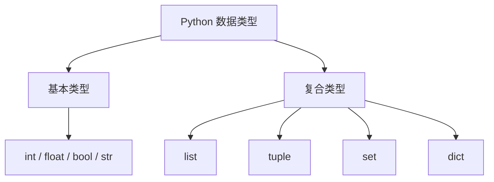

# 🐍 Python 数据类型详解

> 学习 Python 的第一步，就是理解 **数据类型（Data Types）**。  
> 本文将从入门到进阶，带你全面掌握 Python 的各种数据类型，配合代码示例与可视化对比，让学习更轻松！

---

## 📖 一、数据类型概览

Python 是一种**动态强类型语言**，变量不需要声明类型，但每个值都有自己的类型。

主要分为两大类：

| 类型分类 | 具体类型 | 示例 |
|:----------|:-----------|:------|
| **基本类型** | 数字（int、float、bool）、字符串（str） | `42`, `3.14`, `True`, `'Hello'` |
| **复合类型** | 列表（list）、元组（tuple）、集合（set）、字典（dict） | `[1,2,3]`, `(1,2)`, `{1,2}`, `{'a':1}` |

---

## 🔢 二、数字类型（Number）

### 1️⃣ 整数（int）

整数可以是任意大小，没有溢出问题：

```python
a = 123
b = -1999
print(type(a))  # <class 'int'>
```

> ✅ Python 的整数理论上可以无限大，只受内存限制。

### 2️⃣ 浮点数（float）

```python
pi = 3.14159
price = 9.99
print(pi * 2)
```

> ⚠️ 注意：浮点数存在精度问题，比如 `0.1 + 0.2 != 0.3`

### 3️⃣ 布尔值（bool）

布尔值只有 `True` 和 `False`：

```python
x = True
y = False
print(x and y)  # False
```

Python 中以下值会被视为 **False**：
- `0`  
- `''`（空字符串）  
- `[]`（空列表）  
- `{}`（空字典）  
- `None`

---

## 💬 三、字符串（str）

字符串是 Python 中最常用的数据类型之一。

### 🔹 定义字符串

```python
s1 = "Hello"
s2 = 'World'
s3 = '''多行
字符串'''
```

### 🔹 常用操作

| 操作 | 示例 | 结果 |
|------|------|------|
| 拼接 | `'Hello' + 'World'` | `HelloWorld` |
| 重复 | `'Hi' * 3` | `HiHiHi` |
| 索引 | `'Python'[0]` | `P` |
| 切片 | `'Python'[1:4]` | `yth` |

### 🔹 字符串方法

```python
s = "hello world"
print(s.upper())   # HELLO WORLD
print(s.title())   # Hello World
print(s.replace("world", "Python"))  # hello Python
```

---

## 🧺 四、列表（list）

> **列表是可变的、有序集合**，最灵活的复合数据类型。

```python
fruits = ["apple", "banana", "cherry"]
fruits.append("orange")
print(fruits)  # ['apple', 'banana', 'cherry', 'orange']
```

### 常见操作

| 方法 | 功能 |
|------|------|
| `append()` | 追加元素 |
| `insert(i, x)` | 在指定位置插入 |
| `pop()` | 删除并返回最后一个元素 |
| `remove(x)` | 删除指定值 |
| `sort()` | 排序 |
| `reverse()` | 反转 |

---

## 🧱 五、元组（tuple）

> **元组是不可变的有序集合**，适合存储固定数据。

```python
point = (10, 20)
print(point[0])  # 10
```

⚠️ 元组中的值不能修改，但可以包含可变对象：

```python
t = ([1, 2], 3)
t[0].append(4)
print(t)  # ([1, 2, 4], 3)
```

---

## 🧩 六、集合（set）

> Python 中的集合（set）是一种无序且不重复的元素集合，它常用于去重、集合运算以及快速查找。下面我们来详细介绍集合的相关内容及操作。

---

### 🔹集合的定义

```python
# 使用大括号定义集合
fruits = {'apple', 'banana', 'orange'}
print(fruits)

# 使用 set() 函数创建集合
numbers = set([1, 2, 3, 4, 4, 2])
print(numbers)  # 输出: {1, 2, 3, 4}，重复元素会自动去掉
```

**特点**：
- 集合是无序的，无法通过索引访问元素。
- 元素唯一，重复的元素会被自动删除。
- 元素必须是不可变类型，例如字符串、数字、元组等。

---

### 🔹集合的基本操作

```python
# 添加元素
fruits.add('grape')

# 删除元素
fruits.remove('banana')  # 如果元素不存在会报错
fruits.discard('banana')  # 如果元素不存在不会报错

# 清空集合
fruits.clear()

# 判断元素是否存在
print('apple' in fruits)
```

---

### 🔹集合运算

Python 集合提供了多种运算，主要包括交集、并集、差集和对称差集。

#### 3.1 交集（Intersection）

获取两个集合中都存在的元素。

```python
A = {1, 2, 3, 4}
B = {3, 4, 5, 6}

# 方法1
print(A & B)  # 输出: {3, 4}

# 方法2
print(A.intersection(B))  # 输出: {3, 4}
```

#### 3.2 并集（Union）

获取两个集合中所有不同的元素。

```python
# 方法1
print(A | B)  # 输出: {1, 2, 3, 4, 5, 6}

# 方法2
print(A.union(B))  # 输出: {1, 2, 3, 4, 5, 6}
```

#### 3.3 差集（Difference）

获取存在于 A 集合但不存在于 B 集合的元素。

```python
# 方法1
print(A - B)  # 输出: {1, 2}

# 方法2
print(A.difference(B))  # 输出: {1, 2}
```

#### 3.4 对称差集（Symmetric Difference）

获取在 A 或 B 中，但不同时存在的元素。

```python
# 方法1
print(A ^ B)  # 输出: {1, 2, 5, 6}

# 方法2
print(A.symmetric_difference(B))  # 输出: {1, 2, 5, 6}
```

---

### 🔹集合应用场景

1. **去重**
```python
nums = [1, 2, 2, 3, 3, 3]
unique_nums = list(set(nums))
print(unique_nums)  # 输出: [1, 2, 3]
```

2. **集合运算**
   - 比如求两个班级的共同学生、所有学生或者只在一个班的学生。

3. **快速查找**
   - 集合的元素是无序的哈希结构，查找效率高。

---

## 📚 七、字典（dict）

> **字典是键值对（key-value）形式的可变集合。**

```python
person = {"name": "Alice", "age": 25}
print(person["name"])  # Alice
```

### 常用操作

| 操作 | 示例 | 说明 |
|------|------|------|
| 访问值 | `person['age']` | 取值 |
| 新增键值 | `person['city'] = 'Beijing'` | 添加数据 |
| 删除键 | `del person['age']` | 删除数据 |
| 遍历 | `for k,v in person.items():` | 遍历字典 |

---

## 🧮 八、类型转换（Type Casting）

| 函数 | 作用 | 示例 |
|------|------|------|
| `int(x)` | 转为整数 | `int(3.14) → 3` |
| `float(x)` | 转为浮点数 | `float('2.5') → 2.5` |
| `str(x)` | 转为字符串 | `str(123) → '123'` |
| `list(x)` | 转为列表 | `list('abc') → ['a','b','c']` |
| `set(x)` | 转为集合 | `set([1,2,2]) → {1,2}` |
| `dict(x)` | 转为字典 | `dict([('a',1),('b',2)])` |

---

## 🔍 九、特殊类型：None

`None` 表示**空值**或**无返回值**。

```python
def say_hello():
    print("Hello")

result = say_hello()
print(result)  # None
```

---

## 🧠 十、可变与不可变类型

| 分类 | 类型 | 是否可变 |
|------|------|-----------|
| 不可变 | int, float, bool, str, tuple | ❌ |
| 可变 | list, set, dict | ✅ |

```python
x = [1, 2, 3]
y = x
x.append(4)
print(y)  # [1,2,3,4]，y也变了！
```

> 💡 **可变对象共享内存引用**，注意浅拷贝与深拷贝的区别。

---

## 🧭 十一、总结思维导图



---

## ✨ 小结

- Python 的数据类型丰富且灵活。  
- 理解“**可变性**”与“**引用**”是进阶的关键。  
- 熟悉每种类型的**方法与使用场景**，能让你写出更高效的代码。

---

::: tip 🎯 推荐练习
1. 创建一个列表保存班级学生姓名，要求去重并按字母排序。  
2. 编写一个字典存储学生信息（姓名、年龄、成绩），计算平均成绩。  
3. 尝试将字符串 `'12345'` 转换为整数列表 `[1,2,3,4,5]`。
:::

---

> ✍️ 作者：崔鹏飞  
> 📅 更新时间：2025年10月  
> 📚 分类：Python 基础教程